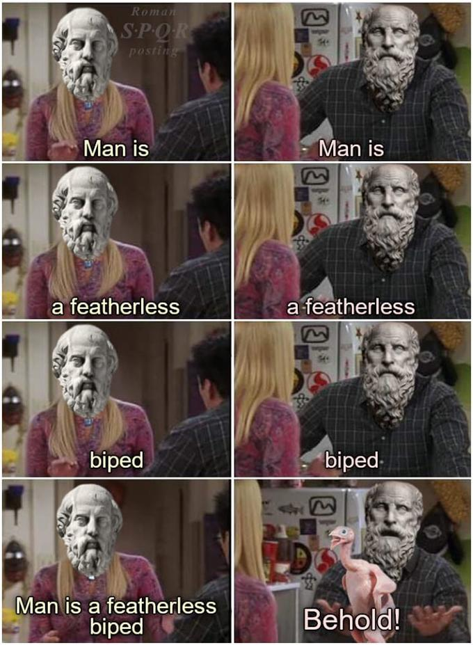

# On distributed systems

Magic: the Gathering, a collectible card game I've played off and on for three decades, recently revealed a new mechanic called "behold." 
Doing so led players to resurrect a 2500 year old meme of Plato defining man as a featherless biped, and a student named Diogenes then plucking a chicken, and exclaiming, "behold a man!"

Rather than learning the lesson that reductive definitions of complex things will always leave much to be desired, humanity has instead spent quite a lot of time debating the specifics of what things _are_. 
The branch of philosophy that deals with this is called Metaphysics. 
And today I'd like to take you on a pleasant stroll through the metaphysics of distributed systems. 

Lest the mixing of philosophy and computer science sound boring, let me assure you at least that I'm sitting here plucking feathers.

## Definitions

Any reasonable discussion about wha things are needs to start with what things you're talking about in the first place. 
For this post the three most important things would be computers, what we mean by distributed, and systems. 
Let's start with the last, and work our way backwards.

Some dictionary that DuckDuckGo is using defines the computing relevant definition of a system as, "A network of related computer software, hardware, and data transmission devices."
Sweet.

Of course now we need to define network, computer, software, hardware, data, transmission, and devices. 

This might seem trivial and pedantic (or just annoying), but do data transmission devices include the global network of cell towers and satellites that make our phones work? 
Does the software and hardware that runs the power plants being build to train AI models belong to that system?

A cursory glance at distributed doesn't help much.
Wikipedia says a system is distributed when two networked computers both perform work within the system. 
Pretty much every commercial app contains something that calls to some cloud. 
So is everything distributed?

Maybe definitions aren't the best place to start. 

## Appeal to authority

The truth is that language is imprecise. 
If it wasn't, metaphysics wouldn't exist in the first place.
So often we search for other ways of establishing "truth" in what it is we discuss. 

In the early seventies, Clifford Geertz--probably the most influential anthropologist of that half of the century--windmill slammed a series of essays entitled, "Religion as a Cultural System."
In it, Geertz describes religions as a system of symbols where the symbols take on specific and significant meaning for the adherents of the religion. 
If we consider tech jargon as symbols, anyone who has spent time witnessing online polemics between the adherents of different factional developers will know Geertz's definition was perhaps a little narrow.

After all, what's more sublime--transport-agnostic or transubstantiation?
More occult, Kubernetes or Kabbalah?
More haram, unauthorized use or authorized usury?

It may be a bit of a stretch to imply that religions exist due to our inability to define terms, but certainly we can appreciate the need to establish credibility by appealing to the progenitor of the terms we're trying to define. 
In the case of religion, of course, the authority to appeal to is sufficiently important enough to be recognized definitively as the authority.
Which is why no conflict has ever arisen due to religion.

Unfortunately for us developers, our authorities are flawed humans, and thus conflict is the norm. 

### Do you know the word deontological?

It is admittedly reductive to generalize about religions, but this is a programming blog post so I don't much care.
Most religions are _proscriptive_ in how humans should behave, and provide some promise of future reward for adhering to that behavior.
The fancy pants term for this type of morality is deontological, from the Greek _deon_ meaning duty. 
Namely if you perform your duty of not masturbating (honestly the constant proscription against masturbation might be the strongest argument for the divine inspiration of our planet's holy works, as it's hard to believe any human would think that to be a reasonable rule for everyone to follow), you'll get to Heaven, or find The Way, or attain Nirvana, or cross the bridge to Takamagahara or Valhalla.

Software in 2025 has similar ethics. 
It shouldn't be all that surprising that the same creatures who lean towards deontology in most things should apply it to the things that they create, but while the verdict may be out on whether we have free will or not, the machines we program definitely aren't there yet. 
The only Valhalla for them is to perhaps be recycled into future machines to try their hand in this samsara world once more.

### What's the opposite of telling people what to do?

Didn't drop in to this tech blog for a historical look at philosophical systems? 
Fair enough.
I mean it seems kind of relevant in this age of people claiming machines will soon surpass us lowly meat bags, but if that's enough let's just see where this goes.

There's a totally reasonable psychological need to believe that things _have_ to be the way they are or society will devolve into utter chaos.
But I feel this undermines the human spirit. 
We've shown over and over again that if we need to get from a to b, we'll figure out how to get there--oceans, mountains, deserts, and intersections without blinking lights guiding us be damned.

_We_ are smart, creative, and recalcitrant.
The tools, and now machines we create, are not. 
At least not yet.[^1]

But just like the deities we anthropomorphize to justify the laws attributed to them, we grant to the machines the same deontology we suffer ourselves.
We write our specs with MUSTs and SHOULDs and REQUIREDs, and sure there's a reasonable need to believe things _have_ to be that way in order to work, but do they?

### What is my purpose?

The deontologists whose thinking dominates the Abrahamic religions that are known most to the western world have a lot to owe to Plato, and his absolutist framing of metaphysics. 
I won't debate the merits of his philosophy here, but I will acknowledge I'm not a fan.

The Ancient Greek counterpoint to Plato came from his student Aristotle. 
Interestingly, Aristotle's work was more or less contemporaneous with the religions of the Eastern world who also deviate from deontology like Hinduism, Buddhism, Confucianism, and Daoism. 
This other way of being is called teleological, from the Greek _telos_ meaning "goal" or "purpose." 

It is best summed up for our purposes by this gif:

No doubt we're in for a future where robots feel some chagrin at their purpose in life, and I imagine the fact that we've come prepacked with emotions is a likely cause of why deontology has won out over teleology. 
The existential dread that comes with the knowledge that our existence may indeed be finite, and thus rather than working towards some future reward we might want to spend a bit of time on the present can make it hard to hone in on a worthy purpose. 

But for our machines, their existence is finite, and they have no pesky self-awareness to keep them from fulfilling some useful purpose in search of greater meaning...yet.

Aristotle believed the purpose for humans was ευδαιμονία, an Ancient Greek word that sort of translates etymologically to "the good life." 
Good is a really loaded word in our judeochristian western world, and so I'd advise to not put too much stress on any idea there.
For Aristotle, ευδαιμονία was a life of leisure, where we are free to explore philosophical pursuits, and drink wine all day.
The way to do this, of course, is to utilize an intricate system of slavery and withheld citizenship so as to protect your interests from the yolk of day-to-day laboring. 

I did advise not to put too much weight on the good there.

Still, it's an interesting exercise to try and think what might be the goal, the Τελοσ in teleology, for our machines.
Unlike wealthy Athenians, they don't have strange-speaking foreigners to exploit.
Instead we expect them to work.

So what should they do?

[^1]: AI is real hot right now. But rather than quibble over definitions of intelligence, let's just say that the LLMs everyone's paying for right now aren't going to skynet us off the map just yet. 
